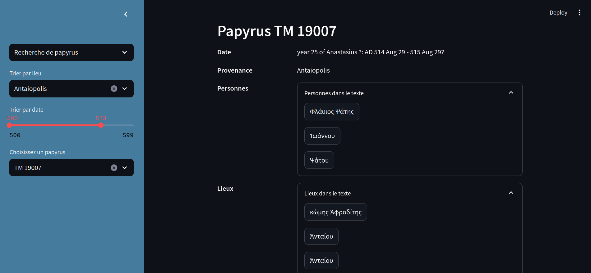

# Papyrus Hunting

This repository contains code written for a school project focused on data analysis. In this repo, you'll find an application that allows you to gather data on papyri from various places and times in antiquity. This data was automatically retrieved from the [Trismegistos collection](https://www.trismegistos.org/). All data can be found in the `data` directory, and scripts used for analysis and scraping are in the `scripts` directory.


# App

The Papyrus App can be accessed using Streamlit and the `streamlit_papyrus.py` script.

**Command to run the app:**

```bash
streamlit run streamlit_papyrus.py
```


# Functionalities

You can choose among 3 modes : 


### 1. Recherche de papyrus

In this mode, you can specify a location and a date interval and choose from the resulting documents. Once you select a papyrus, you'll have access to more precise information about the date of writing and the provenance, as well as a listing (when available) of the characters and places mentioned in the text.



You will also find the content of the text with annotations regarding specific writing choices. This feature allows you to see how a word is written in the text and how it should normally be written in ancient Greek.


Additionally, you can view the locations of the mentioned places in the text on a map when available!

### 2. Chiffres par lieu

This mode allows you to select a location and obtain statistics about the documents originating from that place. You will discover the most common dates of writing, as well as the most frequently mentioned names and locations.


### 3. Chiffres par date

Finally, this mode enables you to obtain statistics about documents written within a specified date range. For any interval that you choose, you'll find a histogram displaying the most common origin locations of the documents and the names and places most often mentioned in them.


🏹 **GOOD HUNT !** 🏹